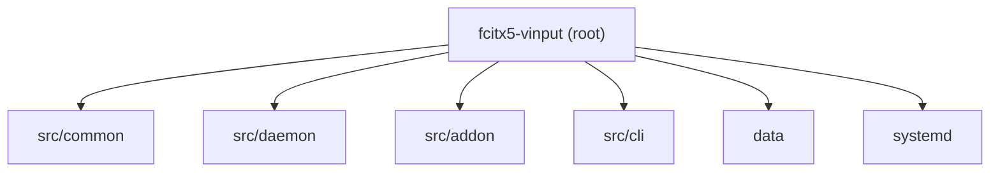

# fcitx5-vinput

## 项目愿景

fcitx5-vinput 是一个基于 sherpa-onnx ASR 引擎的 Fcitx5 离线语音输入插件。用户按住触发键录音，松开后自动识别并提交文本，可选通过 LLM 后处理优化识别结果。项目追求完全离线、低延迟的语音输入体验。

## 架构总览

项目由三个可执行组件和一个共享静态库组成：

- **vinput-daemon** -- ASR 守护进程，通过 PipeWire 采集音频、sherpa-onnx 推理、可选 LLM 后处理，通过 D-Bus 暴露服务
- **fcitx5-vinput** -- Fcitx5 输入法模块（共享库），拦截按键事件、通过 D-Bus 与 daemon 通信、管理 preedit 和候选菜单
- **vinput** -- CLI 管理工具，管理模型下载/场景/LLM 提供商/配置/daemon 生命周期
- **vinput-common** -- 静态库，封装配置加载、模型管理、场景定义、识别结果序列化等共享逻辑

通信方式：addon 与 daemon 之间通过 session D-Bus（`org.fcitx.Vinput`）通信。daemon 作为 systemd user service 运行，支持 D-Bus 自动激活。

技术栈：C++20, CMake, nlohmann_json, libcurl, PipeWire, sd-bus (libsystemd), sherpa-onnx, CLI11, libarchive, OpenSSL

## 模块结构图



## 模块索引

| 模块路径 | 构建产物 | 语言 | 职责 |
|---------|---------|------|------|
| `src/common` | `libvinput-common.a` | C++20 | 共享静态库：配置、模型管理、场景、结果序列化、路径/文件工具 |
| `src/daemon` | `vinput-daemon` | C++20 | ASR 守护进程：音频采集、推理、后处理、D-Bus 服务端 |
| `src/addon` | `fcitx5-vinput.so` | C++20 | Fcitx5 输入法模块：按键拦截、preedit、候选菜单、D-Bus 客户端 |
| `src/cli` | `vinput` | C++20 | CLI 工具：模型/场景/LLM/配置/daemon 管理 |

## 运行与开发

### 构建

```bash
cmake -B build -DCMAKE_BUILD_TYPE=Release
cmake --build build -j$(nproc)
```

### 依赖

- 系统依赖：Fcitx5Core, Fcitx5Config, nlohmann_json (>=3.2), libcurl, libsystemd, PipeWire (libpipewire-0.3), libarchive, OpenSSL
- 捆绑依赖：sherpa-onnx (位于 `third_party/sherpa-onnx/`，含 .so 库和头文件)
- CLI11：构建时自动 FetchContent（若系统未安装）

### 安装目标

- `vinput-daemon` -> `${CMAKE_INSTALL_BINDIR}`
- `fcitx5-vinput.so` -> Fcitx5 addon 目录
- `vinput` (CLI) -> `${CMAKE_INSTALL_BINDIR}`
- `vinput-model-setup` (脚本) -> `${CMAKE_INSTALL_BINDIR}`
- systemd user service -> `${VINPUT_SYSTEMD_USER_DIR}`
- D-Bus 激活文件 -> `${VINPUT_DBUS_SERVICE_DIR}`
- sherpa-onnx 运行时库 -> `${VINPUT_RUNTIME_LIBDIR}`

### 配置文件

| 文件 | 格式 | 用途 |
|------|------|------|
| `~/.config/fcitx5/conf/vinput.conf` | INI (Fcitx) | addon 设置：触发键、场景菜单键、翻页键 |
| `~/.config/vinput/config.json` | JSON | daemon/CLI 设置：活跃模型、LLM 配置、UI 语言等 |
| `~/.config/fcitx5/conf/vinput-scenes.json` | JSON | 用户场景配置 |
| `~/.local/share/fcitx5-vinput/models/<name>/vinput-model.json` | JSON | 模型元数据 |

### D-Bus 接口

- Bus name: `org.fcitx.Vinput`
- Object path: `/org/fcitx/Vinput`
- Methods: `StartRecording`, `StopRecording(scene_id) -> text`, `GetStatus -> status`
- Signals: `RecognitionResult(payload_json)`, `StatusChanged(status_string)`
- 状态机: Idle -> Recording -> Inferring -> [Postprocessing] -> Idle

## 测试策略

当前项目**无自动化测试**。没有 tests/ 目录，没有测试框架配置。

## 编码规范

- C++20 标准，CMake 最低 3.16
- 头文件使用 `#pragma once`
- 命名空间：`vinput::dbus`, `vinput::scene`, `vinput::result`, `vinput::path`, `vinput::file`, `vinput::config`, `vinput::cli`
- 类使用 PascalCase，方法使用 PascalCase，成员变量使用 snake_case_ 后缀
- 常量使用 `k` 前缀 + PascalCase (如 `kBusName`)
- 内联 i18n：通过 `Msg` 结构体 + `UseChineseUi()` 判断中英文

## AI 使用指引

- 修改共享逻辑时注意 `vinput-common` 同时被 daemon/addon/cli 三方使用
- D-Bus 接口定义在 `src/common/dbus_interface.h`，修改需同步 daemon 和 addon
- 配置系统有两套：Fcitx INI (`vinput_config.h`) 和 JSON (`core_config.h`)，不要混淆
- 模型目录默认路径：`~/.local/share/fcitx5-vinput/models/`
- 场景系统：内置 4 个场景 (default/formal/code/translate)，用户可通过 CLI 或配置文件自定义

## 变更记录 (Changelog)

- **2026-03-11T02:57:26** -- 初始生成 CLAUDE.md（根级 + 4 个模块级）
